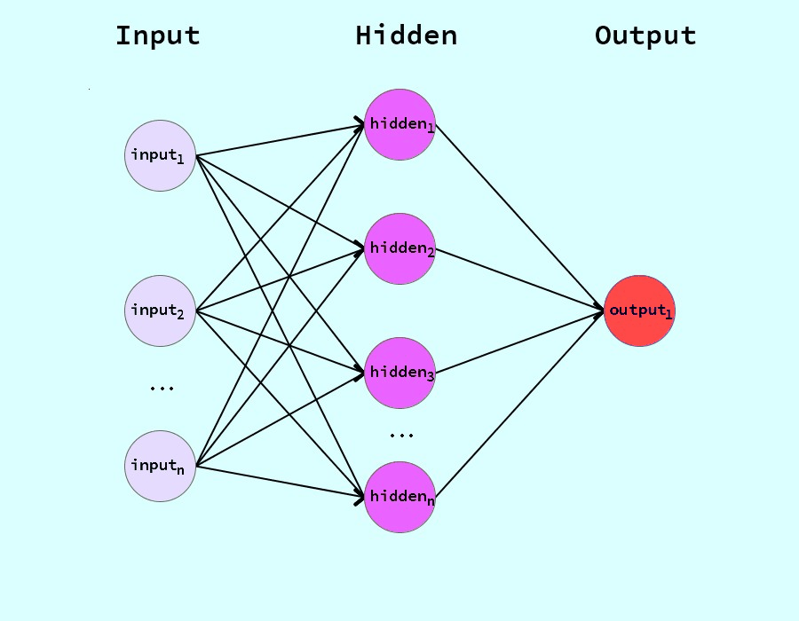

# neural-network-graph
An easy to create neural network graph using processing 3. It has 3 columns; input, hidden, &amp; output. The amount of nodes for the input and hidden columns can be ajusted in the code. The amount of nodes are limited to the space of the screen. 

